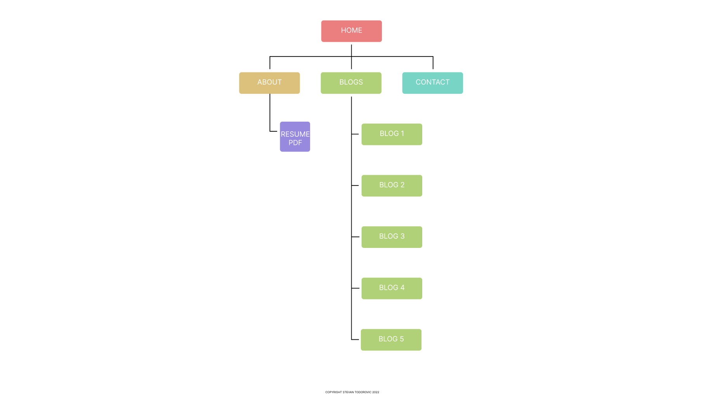
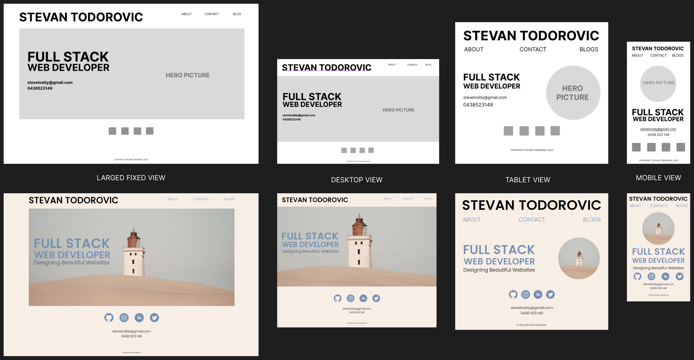
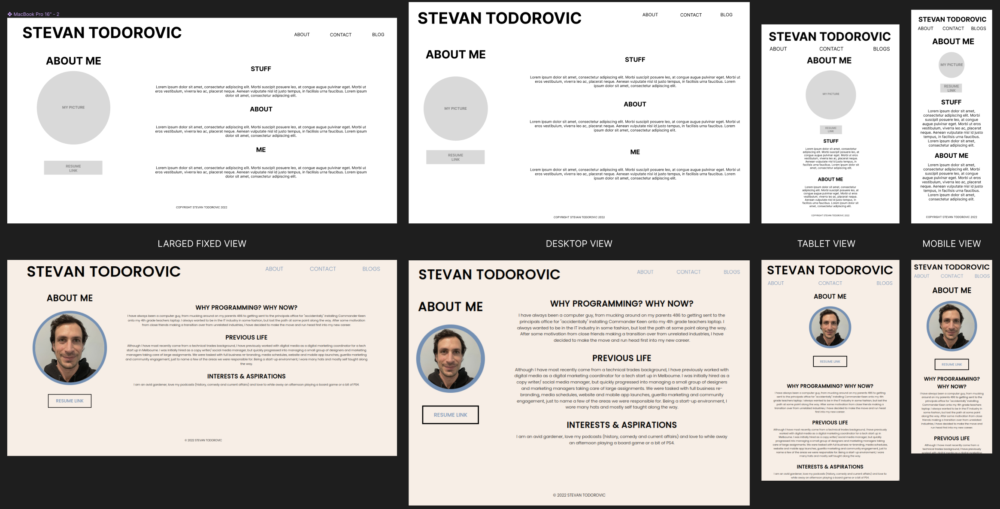
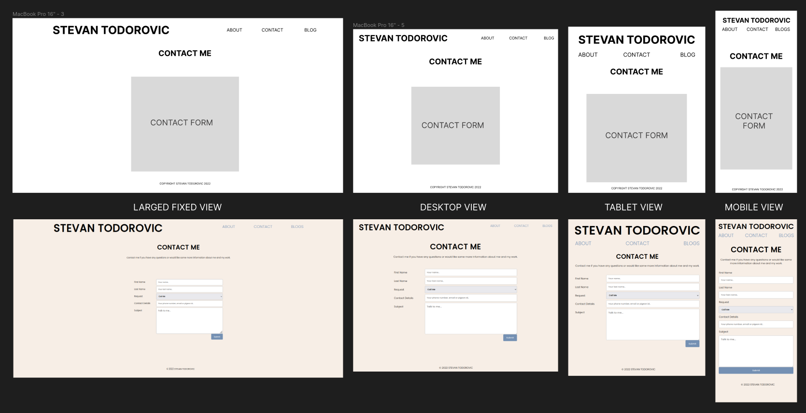
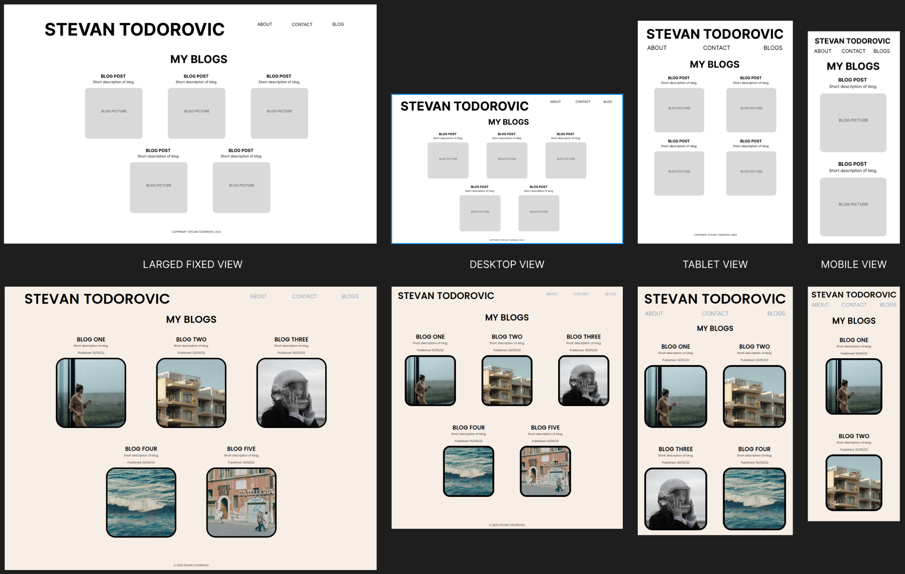
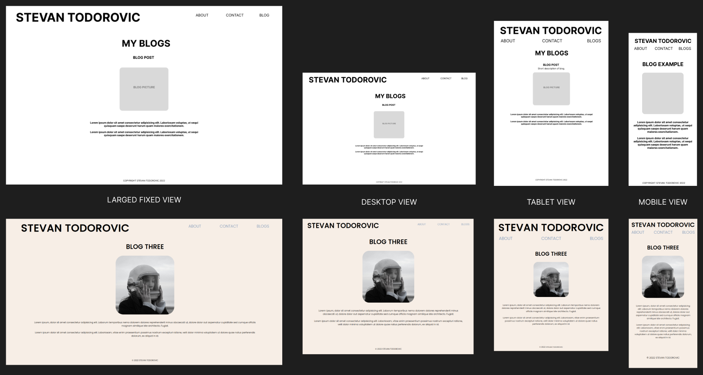

## WEBSITE LINK  

https://stevetoddy.github.io/portfolio-website/

## GITHUB REPOSITORY LINK  

https://github.com/stevetoddy/portfolio-website

## Purpose, Goals and Target Audience  

This portfolio website provides prospective employers an overview of Stevan Todorovic as a professional and an individual. The goal is to engage and entice potential employers, the target audience of the website, and to showcases Stevan's technical aptitude and capabilities.  

---

## Functionality and Features

This website has been designed with a mobile first mind set, optimised for responsive viewing on mobile, tablet and desktop. It has used fully semantic HTML and takes into account accessibility with regards to design and code. The overall design of the website takes a minimal approach in order to give prominence to important information, such as contact and personal details, design principals and overall themes. It contains 4 pages, in addition to 5 individual blog posts and a linked PDF resume.  

The pages are listed below with a brief overview.

- **Home:** The main index page used to navigate to all other pages. Contains important information prominently displayed, such as name, contact info and social/ professional links.

- **About:** Lists personal and professional interests, capabilities and attitudes. Provides a link to a PDF resume.

- **Blogs:** Contains 5 original blog post, showing ability to convey complex ideas and professional aptitude.

- **Contact:** A contact form enticing potential employers to reach out in the easiest way possible.  

---

## Sitemap

 
Each page is connected to each other using the Navigation Links and the Headline as the Home Page link. There are 5 blog post pages linked to the Blog Page and I have a link to a PDF Resume, from the About Page.

---

## Screenshots  

### Home Page

### About Page

### Contact Page

### Blog Page

### Blog Example

---

## Tech Stack

- Wireframs and design: Figma and Shotwell Viewer
- Website: HTML and CSS
- Form backend: Formspree  
- Repository: Github
- Deployment and Hosting: Github Pages